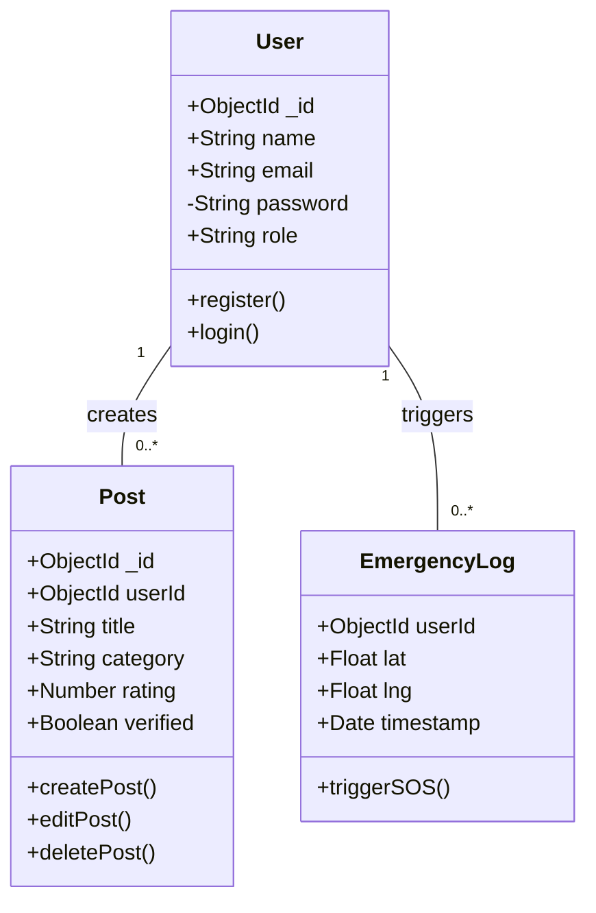
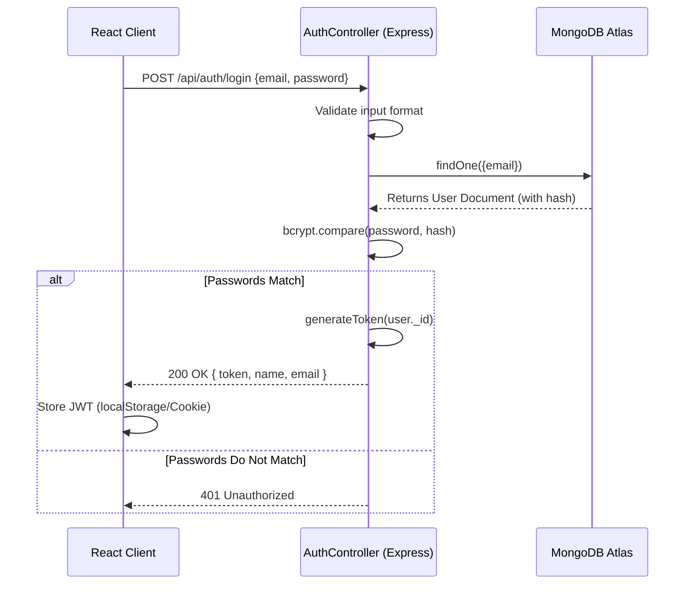
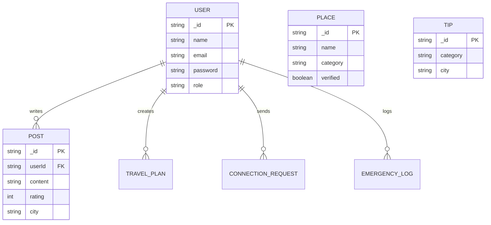

# 🌍 SoloSphere Project Report

**Project Title**: SoloSphere - Safe Journeys & Meaningful Connections  
**Team Members**: Rohan Singh (Lead), Vanshika Yadav, Riya Garg, Ronit Singh, Prakhar Srivastava

---

## 1. Problem Statement and Solution Approach

### **Problem Statement**
Solo travel, especially for women and first-time explorers, presents significant challenges. Traditional travel platforms primarily focus on bookings rather than safety, leaving users exposed to unverified accommodations, lack of local guidance, and feelings of isolation. There is no consolidated, trusted digital space for solo travelers to verify the safety of locations, find matching companions, and access immediate emergency assistance.

### **Solution Approach**
**SoloSphere** bridges this gap by creating a secure, community-driven platform. We developed a Full-Stack application (React + Node.js + Express + MongoDB) built strictly around a safety-first philosophy.  
The approach involves:
1. **Community-Verification System**: Enabling users to share safety reviews and allowing admins to grant "Verified" badges to safe destinations.
2. **Companion Matching Algorithm**: A backend filter that connects travelers based on shared itineraries, dates, and preferences.
3. **Emergency SOS Integration**: A one-click geolocation tracker that logs distress signals directly to the backend.
4. **City-Wise Safety Categories**: Organized travel tips specifically tackling Safety, Transport, Wellness, and Helplines.

---

## 2. System Design Optimization

Applying robust System Design principles was critical to ensure SoloSphere remains responsive and scales seamlessly.

*   **Stateless Architecture via JWT**: By using JSON Web Tokens (JWT), the server does not need to store session states. Every HTTP request carries its authentication payload, allowing horizontal scalability across Vercel’s serverless functions without session mismatch issues.
*   **Decoupled Client-Server Model**: We strictly separated the React frontend from the Express API backend. This micro-architecture approach allows independent deployments, caching strategies (CDN for frontend assets), and separate team scaling.
*   **Database Query Optimization (Indexing)**: To improve performance for frequent read operations, we indexed the `email` field in the User schema and `city` / `category` fields in Places and Posts. This shifted query time complexity from $O(n)$ to $O(\log n)$.
*   **Pagination Implementation**: To prevent expensive, large data payloads from crashing the client and slowing DB response times, endpoints (like `/api/tips` and `/api/posts`) force page boundaries (e.g., `limit=10`). 
*   **Serverless Deployment Scalability**: Deployed on Vercel (Frontend & Edge Functions) and MongoDB Atlas (Cloud Database), offloading infrastructure management and establishing automated scaling based on traffic spikes.

---

## 3. Object-Oriented Programming (OOP) Concepts Used

We effectively used Core Object-Oriented principles, predominantly expressed through TypeScript classes and Mongoose schemas:

*   **Abstraction**: We used Mongoose Schemas (e.g., `User`, `Post`, `Tip`) to abstract away complex native MongoDB querying. Developers interact with high-level objects like `User.create()` rather than raw BSON drivers. The `AuthRouteManager` class abstracts complex Express routing logic into simple methods like `initializeRoutes()`.
*   **Encapsulation**: Authentication logic is heavily encapsulated inside the `AuthController` class. Variables like validation protocols (`validateRequiredFields`), password hashing algorithms (bcrypt), and environment secrets are hidden inside private methods and internal states, exposing only public `registerUser` and `loginUser` interfaces to the routes. 
*   **Inheritance (Composition & Interfaces)**: In TypeScript, we effectively utilized inheritance via interfaces. Specific request interfaces like `RegisterRequestBody` and `LoginRequestBody` inherit basic primitive types and provide a structural contract for the `AuthController` to implement.
*   **Polymorphism**: Implemented heavily in API Error management and Middlewares. The Express `NextFunction` behaves polymorphically—whether a route passes a validation error, a database hit, or an unhandled promise rejection, the central error middleware interprets and adapts the response object accordingly.

---

## 4. Design Patterns Implemented

1.  **MVC (Model-View-Controller) Pattern**:
    *   **Why**: To cleanly separate concerns, drastically improving maintainability.
    *   **How**: `models/` directory houses MongoDB data specifications. The React frontend consumes the API acting as the **View**. The `controllers/` directory binds the two by holding business logic (e.g., Auth, Posting).
2.  **Singleton Pattern**:
    *   **Why**: Connecting to a database repeatedly per request leads to socket exhaustion and memory leaks. Likewise, controller duplication causes overhead.
    *   **How**: `config/db.ts` exposes a single, globally cached MongoDB connection instance. `authController.ts` exports a single created instance: `export default new AuthController();` rather than the raw class.
3.  **Middleware / Decorator Pattern**:
    *   **Why**: To apply shared logic (like verifying tokens) transparently across multiple routes without copy-pasting code.
    *   **How**: `protect.ts` intercepts the request, verifies the JWT, decorates `req.user` with database details, and permits access to protected endpoints using `next()`.
4.  **Factory Method Pattern**:
    *   **Why**: We needed to dynamically bundle routes and validators without making the top-level app initialization messy.
    *   **How**: `createAuthRoutes()` builds new instances of `AuthRouteManager`, initializes them, and returns an encapsulated `Router` object to the main express app.

---

## 5. application of SOLID Principles

*   **S - Single Responsibility Principle**: Each Controller dictates exactly one domain. `authController.ts` only authenticates users. `postController.ts` only writes posts. They do not cross-pollinate tasks.
*   **O - Open/Closed Principle**: The Express Root Router (`GlobalRouter.ts`) allows new URL feature structures (e.g., `/api/payments`) to be added by appending a new module import without requiring modification of existing routes.
*   **L - Liskov Substitution Principle**: Through TypeScript abstractions, a specific module (like error logging) can be replaced by a more advanced subtype (from `console.log` to an external Winston logger) without breaking the application logic. 
*   **I - Interface Segregation Principle**: Massive, "fat" interfaces were avoided. Instead of one large `IUserOperation` interface that forces login routes to implement "update password", we segregated types tightly into `LoginRequestBody`, `RegisterRequestBody`, and `AuthResponse`.
*   **D - Dependency Inversion Principle**: The routes refer to abstraction tokens rather than rigid implementations. Middlewares interact with abstract Request/Response interfaces, which means we can mock tests effortlessly without injecting a physical hard-drive database.

---

## 6. UML Diagrams

*(Note: The diagrams below use Mermaid.js syntax. You can view them directly on GitHub or any Markdown viewer supporting Mermaid).*

### A. Class Diagram



### B. Use Case Diagram

```mermaid
usecaseDiagram
    actor Traveler
    actor Admin

    Traveler --> (Register / Login)
    Traveler --> (Search Safe Places)
    Traveler --> (Read Travel Tips)
    Traveler --> (Write an Experience Post)
    Traveler --> (Trigger Emergency SOS)
    Traveler --> (Find Travel Companion)
    
    Admin --> (Verify Safe Places)
    Admin --> (Delete Inappropriate Posts)
    Admin --> (Manage User Reports)
```

### C. Sequence Diagram (User Login & JWT Workflow)



### D. ER (Entity-Relationship) Diagram



---

## 7. Test Cases and Results

We executed a comprehensive manual API testing matrix mapping expected system behaviors. Below are the core test cases.

| Test ID | Module | Scenario / Description | Expected Outcome | Actual Result | Status |
|---|---|---|---|---|---|
| **TC01** | Auth | Register a new user with valid fields (`name`, `email`, `password`) | Returns `201 Created` with valid Auth `token` & user info | Returned `201 Created` and generated valid JWT | ✅ Pass |
| **TC02** | Auth | Register with an already existing email address | Returns `400 Bad Request` ("User already exists") | Returned `400 Bad Request` | ✅ Pass |
| **TC03** | Auth | Attempt login with invalid password | Returns `401 Unauthorized` ("Invalid credentials") | Returned `401 Unauthorized` | ✅ Pass |
| **TC04** | Posts | Fetch posts **without** Authorization header | Returns `401 Unauthorized` ("Not authorized, no token") | Returned `401` gracefully | ✅ Pass |
| **TC05** | Posts | Fetch posts **with** valid JWT Authorization header | Returns `200 OK` + Paginated Array of Post JSON objects | Returned `200 OK` Array | ✅ Pass |
| **TC06** | Places | Apply filters: Query `/api/places?city=Goa&category=Hostel` | Returns `200 OK` + JSON Array purely filtered by query rules | Filter matched DB perfectly | ✅ Pass |
| **TC07** | SOS | Trigger `/api/emergency/sos` POST with Lat/Lng | Returns `201 Created` and logs coordinate string in Database | Triggered successfully | ✅ Pass |
| **TC08** | UX/UI | Responsiveness of `TravelTips` component on iPhone 12 Pro dimensions | CSS Grid collapses elegantly down to 1-column layout | Layout wrapped perfectly without horizontal scroll | ✅ Pass |

---
**Document Status**: Final Version  
**Generated On**: Current Academic Cycle
